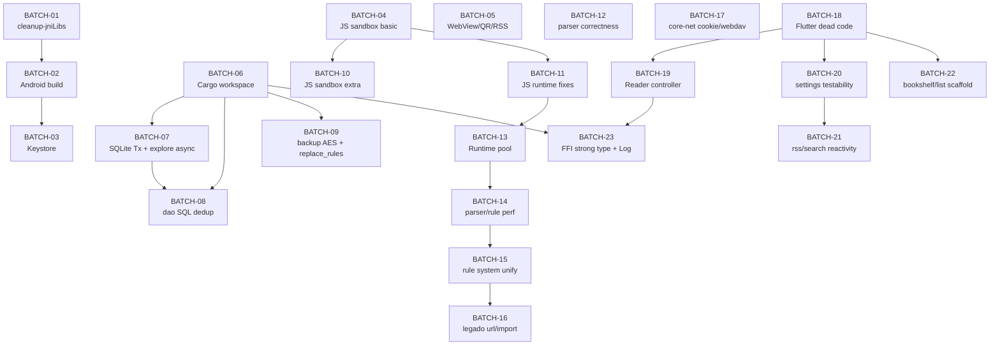

# 跨批次依赖图（dependencies.md）

> 本文档汇总 23 个批次之间的依赖关系，分 4 类：基础设施依赖、重构依赖、资源冲突、数据流依赖。
>
> 用作启动批次时的"前置批次清单"，**未必必须串行**——同类无冲突批次可以并行。

## 1. 基础设施依赖（必须先做）

| 前置批次 | 后续批次 | 原因 |
|---|---|---|
| BATCH-02 (Android signing + R8 + allowBackup) | BATCH-03 (Keystore) | `allowBackup=false` 是凭据迁移到 Keystore 的"防御深度"前提；先关 backup 再迁凭据 |
| BATCH-04 (JS sandbox 基础) | BATCH-10 (JS sandbox 补充) | SSRF 黑名单 / 内存上限 / capability gate 是基础；补充安全（zip-slip / shared vars / template eval）建立其上 |
| BATCH-04 (JS sandbox 基础) | BATCH-11 (JS runtime correctness) | 基础硬化先就位，正确性修复才有同一 sandbox 上下文 |
| BATCH-06 (Cargo workspace deps) | BATCH-07/08/09 (Rust 数据层) | `[workspace.dependencies]` + zeroize/secrecy 是后续 Rust 改动的统一版本基础 |
| BATCH-06 (Cargo workspace deps) | BATCH-23 (FFI / pinning 强化) | `[lints]` 的 unwrap_used = warn 等约束需要 BATCH-06 先落地 |
| BATCH-07 (Tx RAII + with_transaction helper) | BATCH-08 (SQL 列常量 / dao 死代码) | 先有 with_transaction 再抽列常量与上层 SQL 结构变化 |
| BATCH-11 (JS runtime correctness, java.put thread_local) | BATCH-13 (QuickJS Runtime pool) | java.put 跨阶段 write-through 必须先就位，否则 pool 化后行为更不可预测 |
| BATCH-13 (QuickJS Runtime pool) | BATCH-14 (parser/rule perf misc) | Pool 化后 search per-item / css 重复 parse 才能复用同一 runtime cache |
| BATCH-14 (parser/rule perf) | BATCH-15 (rule_engine 统一) | 先 perf 再统一规则系统，避免一边改 perf 一边改架构两次回归 |
| BATCH-15 (rule 系统统一) | BATCH-16 (legado/url & import) | rule 系统选定后才好统一 spawn_blocking 路径与 url helper |
| BATCH-18 (Flutter 死代码 + json_store) | BATCH-19/20/21/22 (Reader / settings / rss / bookshelf) | json_store + json API client wrappers + fontSize 单源 是后续所有 Flutter 改动的基础抽象；先做完再上层改 |
| BATCH-19 (Reader controller) | BATCH-23 (FFI 强类型) | reader controller 化后，apply_replace_rules 等 FFI 调用方收口，迁移强类型才有清晰 caller |
| BATCH-20 (settings testability) | BATCH-21 (rss/search reactivity) | API client wrappers 注入是后续 RSS / search 重构的注入点 |
| BATCH-01 (cleanup jniLibs) | BATCH-02 (Android build) | jniLibs 干净后 release build 验证才能干净跑通 |
| BATCH-06 (Cargo workspace), BATCH-19 (Reader controller) | BATCH-23 (FFI / 错误码 / 日志) | 双前置：BATCH-06 给依赖底座；BATCH-19 给 FFI caller 收口 |

## 2. 重构依赖（必须先做的"基础架构改动"）

| 前置批次 | 后续批次 | 原因 |
|---|---|---|
| BATCH-03 (Keystore wrapper) | (未来与凭据相关的 P2/P3 cleanup 任务) | Keystore wrapper 一旦上线，所有"凭据存储"主题的余下工作都基于此，本路线图内已无后续批次依赖 |
| BATCH-19 (Reader state machine controller) | (未来 reader 性能 / UX P2/P3 cleanup) | reader controller 化是 reader 后续所有重构的基础（P2 P3 也依赖） |
| BATCH-15 (rule system unified) | (未来书源相关 P2/P3 cleanup) | rule_engine vs legado/rule 选一统一后，后续书源开发都基于 legado/rule |

## 3. 不可并行的资源冲突（同时改易冲突）

| 批次 A | 批次 B | 冲突原因 | 处理建议 |
|---|---|---|---|
| BATCH-06 | BATCH-07 / 08 / 09 | 同时改 `core/Cargo.toml` 与各子 crate `Cargo.toml`；BATCH-06 改集中依赖时 BATCH-07/8/9 改子 crate 业务代码必合并冲突 | 严格串行：先 BATCH-06 完成再启 07-09 |
| BATCH-07 | BATCH-08 | 都改 `core/core-storage/src/source_dao.rs` / `download_dao.rs`；事务 helper 与 SQL 列常量 同文件 | 严格串行 |
| BATCH-04 | BATCH-10 | 都改 `core/core-source/src/legado/js_runtime.rs`；前者改 SSRF / 内存 / 文件桥，后者改 zip-slip / shared vars / 模板 eval | 严格串行 |
| BATCH-04 | BATCH-11 | 都改 `core/core-source/src/legado/js_runtime.rs` | 严格串行 |
| BATCH-13 | BATCH-14 | 都改 `core/core-source/src/legado/js_runtime.rs` + `parser.rs`；Runtime pool 与 search per-item perf 强相关 | 严格串行 |
| BATCH-19 | BATCH-23 | 都改 `core/bridge/src/api.rs` 中 `apply_replace_rules` 路径；前者重 reader controller 路由，后者 FFI 强类型 + cache key | 严格串行（路线图已标依赖） |
| BATCH-18 | BATCH-19/20/21/22 | 都改 `flutter_app/lib/core/providers.dart` 与 features/* 共享路径 | 严格串行 |

## 4. 数据流 / 跨层依赖（FFI 契约修改影响 Rust + Dart 两侧）

以下批次涉及 FRB 接口或跨层数据格式变化——**必须**在同一 commit / 同一 PR 中包含 Rust + Dart + FRB regenerate 三步：

| 批次 | FFI 影响 | 处理建议 |
|---|---|---|
| BATCH-07 | `pub fn explore` → `pub async fn explore`（FRB 签名变更）| Rust + Dart caller + flutter_rust_bridge_codegen 一次性完成 |
| BATCH-21 | 新增 `rss_article_get_by_origin_link` FRB 桥 | Rust + Dart 同 PR |
| BATCH-23 | FFI 5-10 条热路径迁移 + BridgeError + `apply_replace_rules(chapter_id)` 改签 + v1 deprecated | Rust + Dart 同 PR；deprecated v1 至少保留 1 个 release |

## 5. 总依赖图（mermaid 风格）

## 6. 并行机会（可同时启动的批次组）

| 并行组 | 批次 | 备注 |
|---|---|---|
| P0 并行组 1 | BATCH-04 + BATCH-05 | 都无依赖；分别 Rust JS sandbox / Flutter WebView/QR/RSS |
| P0 串行链 | BATCH-01 → 02 → 03 | Android 构建链路 |
| P1 早期并行 | BATCH-06 + BATCH-12 + BATCH-17 + BATCH-18 | 4 批无相互依赖 |
| Rust 中段串行 | BATCH-07 → 08；BATCH-11 → 13 → 14 → 15 → 16 | 各自串行链 |
| Flutter 中段并行 | BATCH-19 + BATCH-20 + BATCH-22 (在 BATCH-18 完成后) | 各自串行 |

## 7. 当跳过依赖时会怎样

- 跳过 BATCH-02 直接做 BATCH-03：可行但 backup 仍开，凭据上 Google Auto Backup（防御深度损失）
- 跳过 BATCH-04 直接做 BATCH-10：补充安全失去基础三道闸，攻击面仍大
- 跳过 BATCH-06 直接做 BATCH-07：版本号继续散落，未来加新依赖不一致；不致命但维护负担大
- 跳过 BATCH-18 直接做 BATCH-19/20/21/22：每个 feature 独立写 settings IO + API client，重复模板再扩散；可行但放大技术债
- 跳过 BATCH-19 直接做 BATCH-23：apply_replace_rules 等 FFI 调用方仍散落 reader_page，迁移强类型时改 caller 工作量翻倍

## 8. 启动批次前的 re-verify 清单

由于"路线图可能过期"（某条 P1 在执行另一批时被顺手解决），启动每个批次前 sub-agent 应：

1. 对该批次每条 finding 执行 grep / read 确认问题仍存在
2. 若已被前序批次顺手解决，在子任务 prd.md 中显式记录"F-WXX-NNN: already resolved by batch BATCH-YY"
3. 重新计算 effort（路线图给的 S/M/L 是估算）
4. 若发现新关联（如某条 finding 已演化出新的破坏面），在子任务中说明并扩展 scope（同时 ping 用户）
